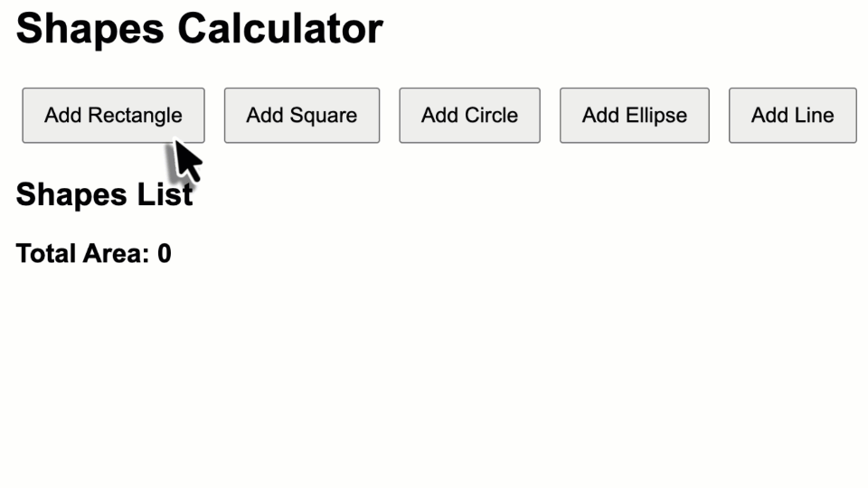

# Shapes Calculator - OOP Exercise

## Overview

This exercise focuses on **Object-Oriented Programming (OOP)** principles in TypeScript. You will work with a shapes calculator application that demonstrates inheritance, polymorphism, abstraction, and encapsulation.

## Learning Objectives

By completing this exercise, you will demonstrate your understanding of:

- **Inheritance**: Creating class hierarchies where child classes inherit properties and methods from parent classes
- **Polymorphism**: Using the same method name in different classes with different implementations
- **Abstraction**: Creating abstract classes that define a common interface for derived classes

## Application Requirements

The application must:

1. **Display a list of shapes** with their descriptions and calculated areas
2. **Calculate total area** of all shapes in the list
3. **Support multiple shape types**:
   - Rectangle (width, height)
   - Square (side length) - derived from Rectangle
   - Circle (radius) - derived from Ellipse
   - Ellipse (radiusX, radiusY)
   - Line (length) - has area of 0
4. **Provide UI controls** to add random shapes to the list

## Key Components

### Abstract Base Class `Shape`

The `Shape` class has to be an **abstract base class** that defines the common interface for all shapes:

- **Abstract property** `description`
- **Concrete method** `calculateArea(): number` (provides default implementation, returns 0)

### Concrete Shape Classes

After implementing the abstract base class, create the following concrete shape classes:

- `Rectangle`: Basic rectangle with width and height
- `Square`: Square with side length, special case of rectangle
- `Ellipse`: Basic ellipse with two radii (`area = π * radiusX * radiusY`)
- `Circle`: Circle with radius, special case of ellipse
- `Line`: Line with length, area is always 0

Put all shape-related classes in a dedicated file (=module) named `shapes.ts`.

### Main Application Logic

In `index.ts`, implement the main application logic that:

- Event listeners for adding shapes
- Shape management and display logic
- Total area calculation
- HTML list building functionality

Make sure to use polymorphism to treat all shapes uniformly as `Shape` objects.

Note that the starter code already contains CSS style that you can use in your application. Feel free to modify or extend it.

## Evaluation Criteria

Your understanding will be evaluated based on:

1. **Correct implementation** of OOP principles in the shape hierarchy
2. **Proper use** of inheritance, polymorphism, abstraction, and encapsulation
3. **Functional application** that correctly calculates and displays shape areas

In order to pass the exam, your implementation must meet the following requirements:

- Code must compile without errors
- You have at least the base class and two derived classes implemented
- The application can display the list of shapes with their descriptions
- You applied basic OOP principles correctly

---

# Formenrechner - OOP-Übung

## Übersicht

Diese Übung konzentriert sich auf die Prinzipien der **objektorientierten Programmierung (OOP)** in TypeScript. Sie arbeiten mit einer Formenrechner-Anwendung, die Vererbung, Polymorphismus, Abstraktion und Kapselung demonstriert.

## Lernziele

Durch das Abschließen dieser Übung demonstrieren Sie Ihr Verständnis von:

- **Vererbung**: Erstellen von Klassenhierarchien, bei denen Kindklassen Eigenschaften und Methoden von Elternklassen erben
- **Polymorphismus**: Verwendung desselben Methodennamens in verschiedenen Klassen mit unterschiedlichen Implementierungen
- **Abstraktion**: Erstellen abstrakter Klassen, die eine gemeinsame Schnittstelle für abgeleitete Klassen definieren

## Anwendungsanforderungen

Die Anwendung muss:

1. **Eine Liste von Formen anzeigen** mit ihren Beschreibungen und berechneten Flächen
2. **Die Gesamtfläche** aller Formen in der Liste berechnen
3. **Mehrere Formtypen unterstützen**:
   - Rechteck (Breite, Höhe)
   - Quadrat (Seitenlänge) - abgeleitet von Rechteck
   - Kreis (Radius) - abgeleitet von Ellipse
   - Ellipse (RadiusX, RadiusY)
   - Linie (Länge) - hat eine Fläche von 0
4. **UI-Steuerelemente bereitstellen**, um zufällige Formen zur Liste hinzuzufügen

## Wichtige Komponenten

### Abstrakte Basisklasse `Shape`

Die `Shape`-Klasse muss eine **abstrakte Basisklasse** sein, die die gemeinsame Schnittstelle für alle Formen definiert:

- **Abstrakte Eigenschaft** `description`
- **Konkrete Methode** `calculateArea(): number` (bietet eine Standardimplementierung, gibt 0 zurück)

### Konkrete Formklassen

Nach der Implementierung der abstrakten Basisklasse erstellen Sie die folgenden konkreten Formklassen:

- `Rectangle`: Grundlegendes Rechteck mit Breite und Höhe
- `Square`: Quadrat mit Seitenlänge, Sonderfall eines Rechtecks
- `Ellipse`: Grundlegende Ellipse mit zwei Radien (`area = π * radiusX * radiusY`)
- `Circle`: Kreis mit Radius, Sonderfall einer Ellipse
- `Line`: Linie mit Länge, Fläche ist immer 0

Platzieren Sie alle formbezogenen Klassen in einer dedizierten Datei (=Modul) mit dem Namen `shapes.ts`.

### Hauptanwendungslogik

In `index.ts` implementieren Sie die Hauptanwendungslogik, die:

- Event-Listener zum Hinzufügen von Formen (alle Parameter werden mit zufälligen Werten zwischen 1 und 100 initialisiert)
- Formverwaltung und Anzeigelogik
- Gesamtflächenberechnung
- HTML-Listenbau-Funktionalität

Stellen Sie sicher, dass Sie Polymorphismus verwenden, um alle Formen einheitlich als `Shape`-Objekte zu behandeln.

Beachten Sie, dass der Startercode bereits CSS-Stile enthält, die Sie in Ihrer Anwendung verwenden können. Fühlen Sie sich frei, diese zu modifizieren oder zu erweitern.

## Bewertungskriterien

Ihr Verständnis wird anhand der folgenden Kriterien bewertet:

1. **Korrekte Implementierung** der OOP-Prinzipien in der Formenhierarchie
2. **Richtige Verwendung** von Vererbung, Polymorphismus, Abstraktion und Kapselung
3. **Funktionale Anwendung**, die Formenflächen korrekt berechnet und anzeigt

Um die Prüfung zu bestehen, muss Ihre Implementierung die folgenden Anforderungen erfüllen:

- Der Code muss ohne Fehler kompilieren
- Sie haben mindestens die Basisklasse und zwei abgeleitete Klassen implementiert
- Die Anwendung kann die Liste der Formen mit ihren Beschreibungen anzeigen
- Sie haben die grundlegenden OOP-Prinzipien korrekt angewendet
