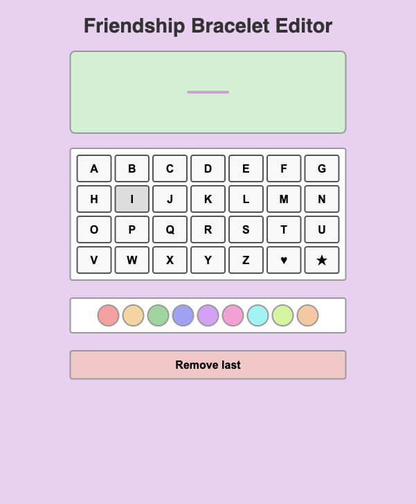
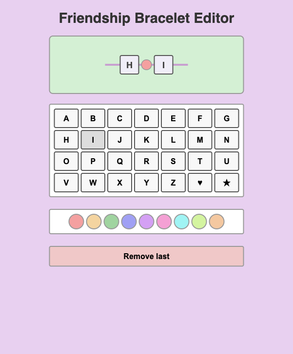
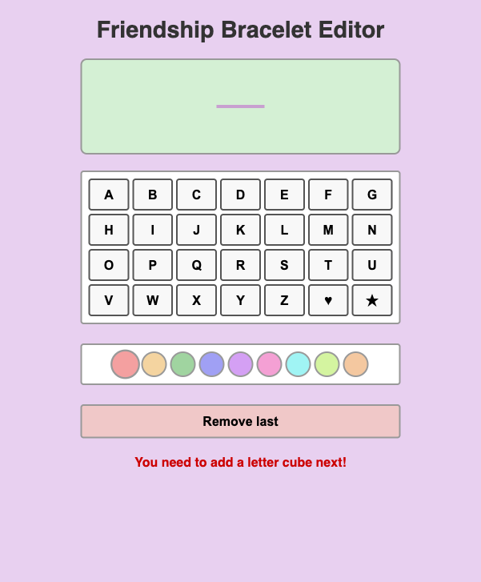
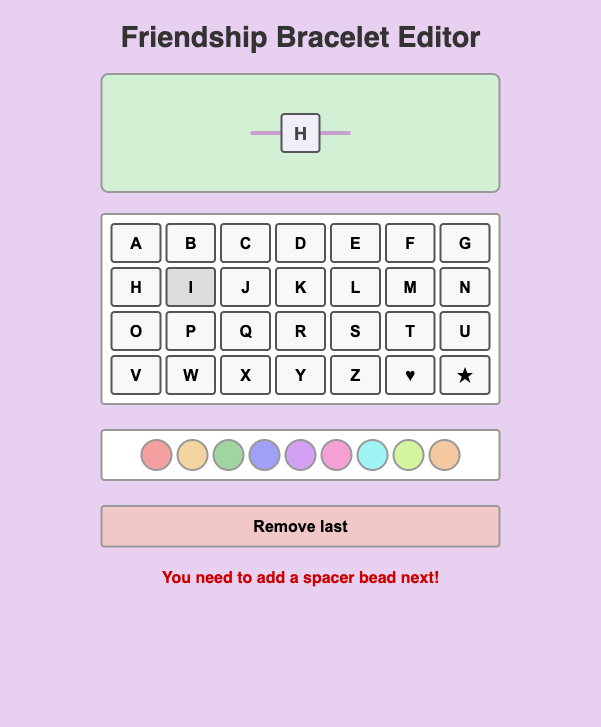
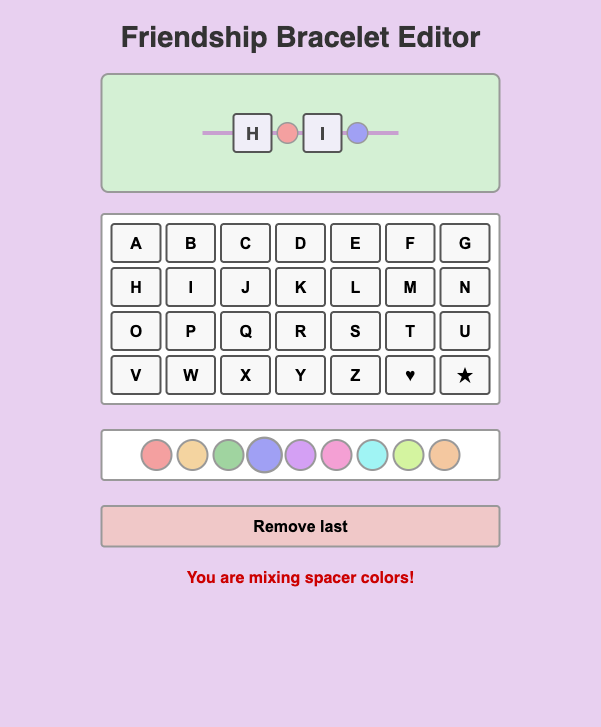

# Friendship Bracelet Editor

## Introduction

In this exercise you will build an interactive **Friendship Bracelet Editor** using TypeScript and object-oriented programming. Additionally, the exercise practices the **stack data structure** — the bracelet is managed as a stack where items are added to and removed from the end (last-in, first-out). The app lets users design a virtual friendship bracelet by placing **letter cubes** (A–Z and symbols ♥, ★) and **colored spacer beads** onto a string. The bracelet is displayed as a live preview that updates as items are added or removed.

The starter code already provides:

- The complete HTML structure and CSS styling
- An abstract base class `BraceletItem` with an abstract `render()` method
- The UI grid-building functions (`buildLetterGrid`, `buildColorGrid`) with placeholder `console.log` calls
- An undo button wired to a placeholder

Your job is to implement the OOP model (item classes + bracelet logic) and connect it to the existing UI.

## Functionality

### Initial State

When the app loads, the bracelet preview area is empty. The user sees a grid of letter/symbol buttons and a row of colored spacer buttons.

### Adding Items

The bracelet follows a strict **alternating pattern**: it must always start with a letter cube, followed by a spacer bead, then a letter cube, then a spacer bead, and so on. The pattern is: **letter, spacer, letter, spacer, ...**

When the user clicks a letter/symbol button, a square **letter cube** is added to the bracelet. When the user clicks a color button, a round **spacer bead** in that color is added.

### Error: Adding a Spacer When a Letter Is Expected

If the user tries to add a spacer bead when the bracelet expects a letter cube (e.g. when the bracelet is empty or the last item was a spacer), an error message is displayed: **"You need to add a letter cube next!"**

The spacer is **not** added to the bracelet.

### Error: Adding a Letter When a Spacer Is Expected

If the user tries to add a letter cube when the bracelet expects a spacer bead (i.e. the last item was a letter cube), an error message is displayed: **"You need to add a spacer bead next!"**

The letter is **not** added to the bracelet.

### Warning: Mixing Spacer Colors

If the user adds spacer beads of **different colors**, a one-time warning is displayed: **"You are mixing spacer colors!"**

This is only a warning — the spacer **is** added to the bracelet. The warning is shown once (the first time two different spacer colors are detected) and does not repeat.

### Undo (Remove Last)

The **"Remove last"** button removes the most recently added item from the bracelet and clears any error message.

## Technical Specification

The starter code provides an abstract base class `BraceletItem` in `Bracelet.ts`. You need to implement:

1. **Two derived classes** for bracelet items — one representing a letter cube and one representing a colored spacer bead. Each must implement the abstract `render()` method to return an appropriate `HTMLElement`. Use the CSS classes already defined in the stylesheet (`.cube` for letter cubes, `.bead` for spacer beads).

2. **A `Bracelet` class** that manages the collection of items and the application logic:
   - Maintaining the list of items on the bracelet
   - Enforcing the alternating pattern (letter → spacer → letter → spacer → …)
   - Displaying error messages when the user violates the pattern
   - Detecting and warning about mixed spacer colors
   - Supporting undo (removing the last item)
   - Rendering the bracelet into the DOM

3. **Wiring up the UI** in `index.ts` — replace the `console.log` placeholders with calls to your `Bracelet` class to add letters, add spacers, and undo.

You are free to choose your own class design, method names, and parameters. The solution should demonstrate proper use of OOP principles (inheritance, encapsulation, abstraction).

## Grading

### Minimum Requirements to Pass

Demonstrate that you understood the principles of OOP by:

- Creating at least **one item class** that extends `BraceletItem` and implements `render()`
- Creating a **`Bracelet` class** that manages items and renders them to the DOM
- Implementing logic in `index.ts` to add at **least one type of item** (letters or spacers) to the bracelet

At this level, error/warning detection is **not** required.

### Grade Determination

Once the minimum requirements are met, the grade is determined by:

- **Completeness** — How much of the specified functionality is implemented (both item types, alternating pattern enforcement, error messages, mixed-color warning, undo)?
- **Code quality** — Clean class and function design, proper use of OOP principles (inheritance, encapsulation), consistent coding style, and readable code.
