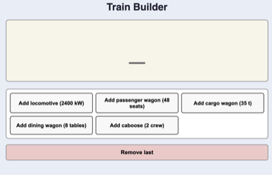
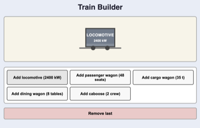
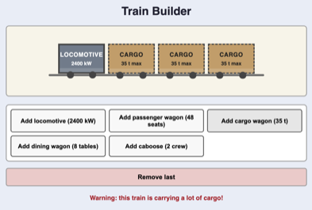
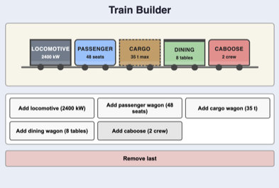

# Train Builder

## Introduction

In this exercise you will build an interactive **Train Builder** using TypeScript and object-oriented programming. The exercise focuses on the **stack data structure**: wagons are added to the end of the train and removed from the end again (**last in, first out**).

The user can assemble a train out of different wagon types. Each wagon type has its own visual style and its own data:

- **Locomotive** with a power value
- **Passenger wagon** with a number of seats
- **Cargo wagon** with a maximum weight
- **Dining wagon** with a number of tables
- **Caboose** with a crew count

The starter code already provides:

- The complete HTML structure and CSS styling
- An abstract base class `TrainPart` with an abstract `render()` method
- Button-building code in `index.ts` with placeholder `console.log` calls
- A remove-last button wired to a placeholder

Your job is to implement the OOP model (wagon classes + train logic) and connect it to the existing UI.

## Functionality

### Initial State

When the app loads, the preview area is empty. The user sees buttons for different train parts and a button to remove the last part.

### Rule 1: The Train Must Start With a Locomotive

If the train is empty, the user may only add a **locomotive**.

If the user tries to add any other wagon first, an error message is displayed:

**"You need to place a locomotive first!"**

The wagon is **not** added.

### Rule 2: Only One Locomotive

A train may only contain **one locomotive**.

If the user tries to add another locomotive after the first one, an error message is displayed:

**"A train can only have one locomotive!"**

The second locomotive is **not** added.

### Rule 3: A Caboose Must Stay At The End

A **caboose** is allowed, but once a caboose has been added, no more parts may be added behind it.

If the user tries to add another wagon after the caboose, an error message is displayed:

**"The caboose must stay at the end of the train!"**

The wagon is **not** added.

### Warning: Heavy Cargo Train

If the total maximum cargo weight of all cargo wagons becomes **more than 100 tons**, a one-time warning is displayed:

**"Warning: this train is carrying a lot of cargo!"**

This is only a warning — the cargo wagon **is** added. The warning should appear only once.

### Remove Last

The **"Remove last"** button removes the most recently added train part and clears any current message.

## Technical Specification

The starter code provides an abstract base class `TrainPart` in `Train.ts`. You need to implement:

1. **Several derived classes** for train parts. Each class should store its own data and implement the abstract `render()` method to return an appropriate `HTMLElement`.
2. **A `Train` class** that manages the collection of parts and the application logic:
   - Maintaining the list of parts on the train
   - Enforcing the locomotive / caboose rules
   - Displaying error messages
   - Detecting and warning about heavy cargo
   - Supporting remove-last
   - Rendering the train into the DOM
3. **Wiring up the UI** in `index.ts` — replace the `console.log` placeholders with calls to your `Train` class.

You are free to choose your own class design, method names, and parameters. The solution should demonstrate proper use of OOP principles such as inheritance, abstraction, and encapsulation.

## Suggested Visual Design

The design can stay simple. For example:

Possible visual differences:

- Locomotive: dark body, solid thick border
- Passenger wagon: blue body, rounded corners
- Cargo wagon: brown body, dashed border
- Dining wagon: green body, double border or thicker roof line
- Caboose: red body, special label

## Grading

### Minimum Requirements to Pass

Demonstrate that you understood the principles of OOP by:

- Creating at least **one class** that extends `TrainPart` and implements `render()`
- Creating a **`Train` class** that manages parts and renders them to the DOM
- Implementing logic in `index.ts` to add at least **one kind of train part**

At this level, all rules and warnings are **not** required yet.

### Grade Determination

Once the minimum requirements are met, the grade is determined by:

- **Completeness** — How much of the required functionality is implemented?
- **Code quality** — Clean class design, correct use of OOP, readable structure, meaningful naming, and consistent style.
